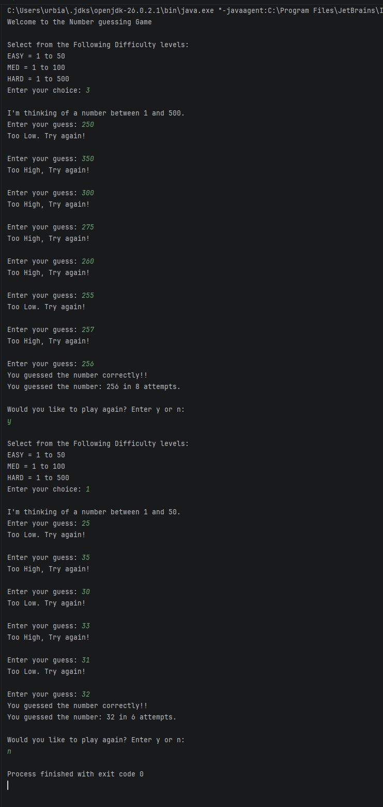

# Module 2 - Number-Guessing-Game

## Description
A program that generates a random number from a difficulty range, and counts 
how many attempts takes the user to guess the random number.

## Getting Started
1. Download the repository files.
2. Open project file with Intellij IDE or another Java editors
3. run the GuessingGame.java file

### Program running

